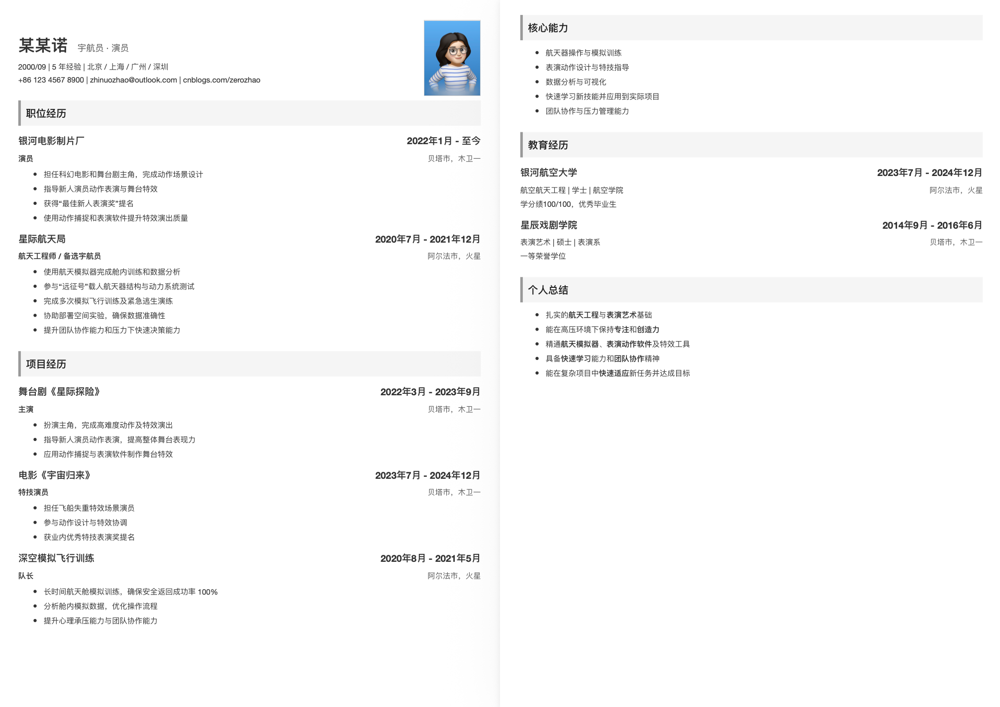
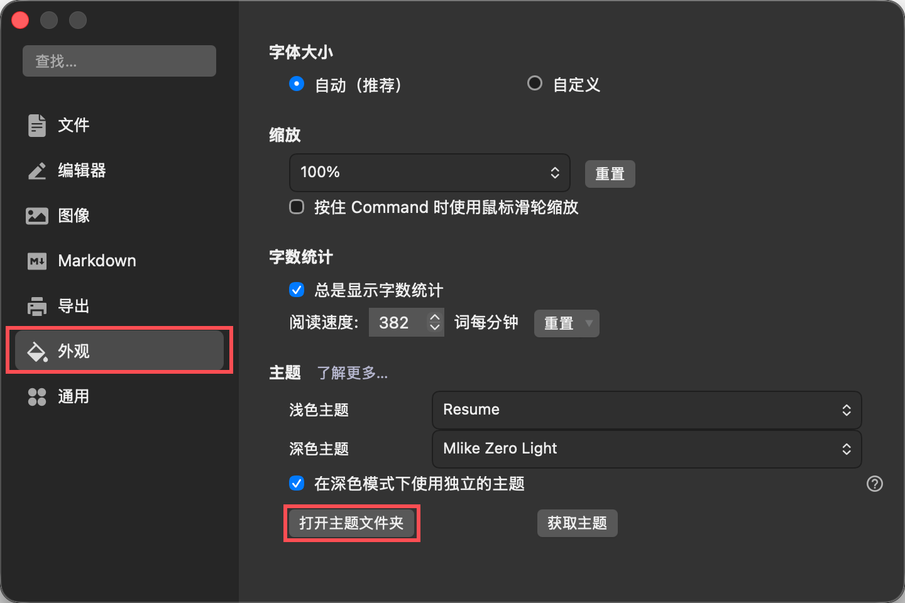
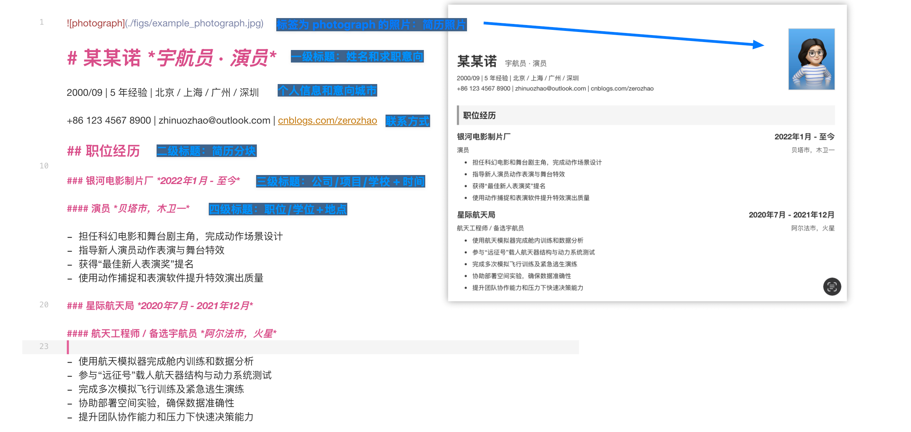
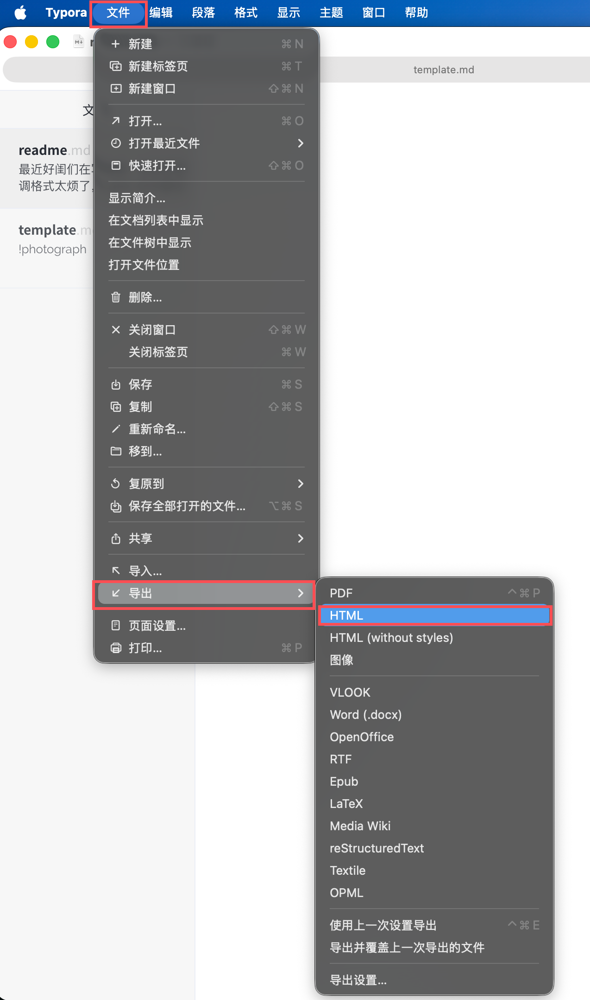
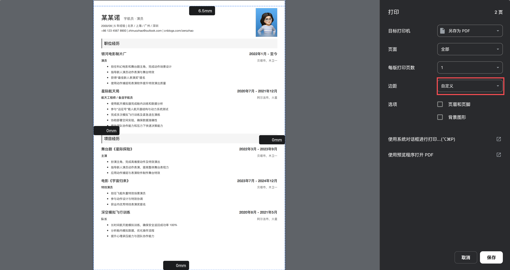

最近好闺们在写简历，写简历要调格式太烦了，LaTex 又太复杂了，还是 markdown 简单，找不到合适的模版，自己加工了一个。就是想用纯 markdown 语法写简历。使用简历的模版是给我编爽了。😃

效果如下：

## Typora 主题安装

`Typora > 设置 > 外观 > 打开主题文件夹`

将`simple_awesome_resume_fonts.css`复制到这个文件夹下，重启 Typora，就可以在主题中看到“Simple Awesome Resume” 了

## 简历撰写

可以直接下载 [template.md](./template.md) 修改修改就可以了。具体如下：

## 导出

由于 Mac 端的 Typora 倒出无非使用 css 中写到打印参数，也没法设定导出 pdf 的左右边距（太匪夷所思了），我这里是用 html 导出，然后用浏览器打开，然后再打印，就可以调节页面边距了。不知道 windows 是什么情况，可能会更方便一些吧。

